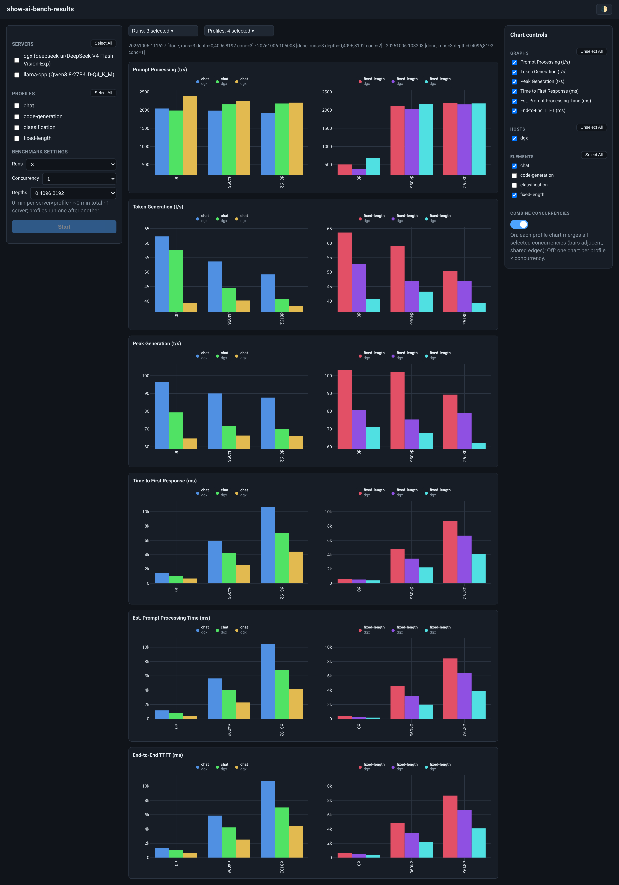
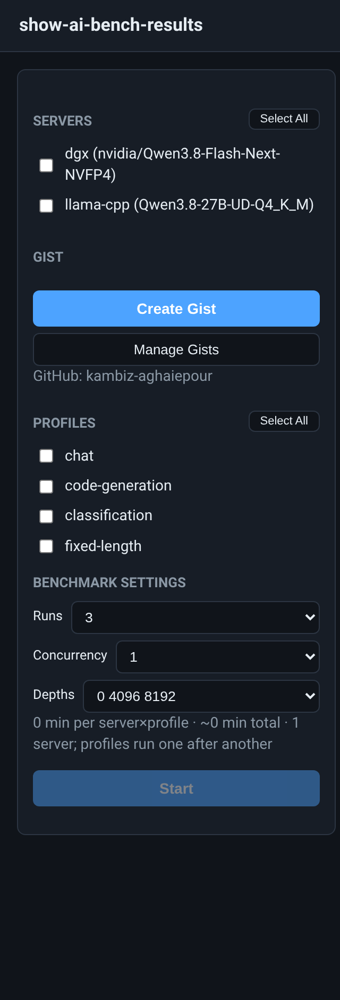
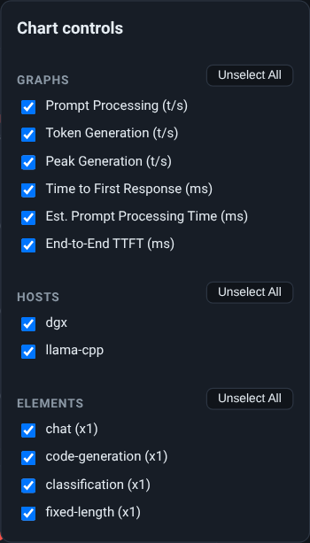
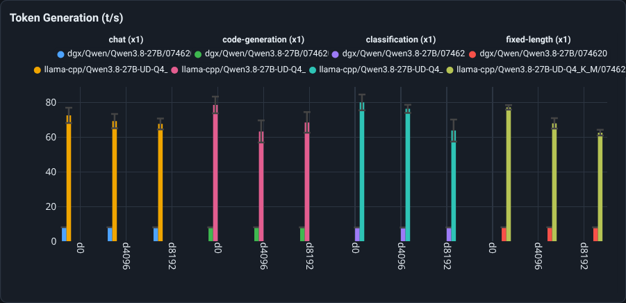

# showaibench

A web visualizer for benchmarking OpenAI-compatible inference servers
(among others [llama.cpp](https://github.com/ggml-org/llama.cpp) and vLLM)
with [llama-benchy](https://github.com/eugr/llama-benchy).

Point it at one or more servers, run its standard workload profiles
(chat, code-generation, classification, fixed-length), and compare the
results of any runs side by side — across servers, runs, context depths,
and concurrency levels.



---

## How it works

```
servers.conf ──► main.py (FastAPI, 127.0.0.1:8585)
                    │
                    ├─ per (server × profile): llama-benchy subprocess
                    │     • servers benchmark IN PARALLEL, profiles serially
                    │     • stdout/stderr streamed to results/<run>/<server>__<profile>.log
                    │       (PYTHONUNBUFFERED → live tailing)
                    │     • JSON report parsed into per-shape metric rows
                    │       (pp/tg throughput ± std, TTFR, est. PPT, E2E TTFT, peak)
                    │
                    ├─ live status: /api/run/<id>/status returns per-entry
                    │   state (pending/running/ok/error) + log tail
                    │
                    └─ persistence: results/<run>/run.json + raw reports
                        (survives restarts; list/select old runs)
```

### Components

| File | Role |
|---|---|
| `main.py` | CLI: `--init` (installs llama-benchy into `.venv`), serves the app, `--start-all` headless mode |
| `showaibench/config.py` | Workload profiles, default settings, `load_servers()` (servers.conf parser) |
| `showaibench/benchmarker.py` | llama-benchy adapter: command construction, live-log streaming, HF token env, report → rows |
| `showaibench/runner.py` | `RunManager`: run orchestration, live status, persistence |
| `showaibench/server.py` | FastAPI app + `/api/*` endpoints + static files |
| `showaibench/static/` | Frontend (plain JS + Plotly, no build step) |
| `manage-webapp` | start / stop / verify the web app (pidfile + health + config drift check) |
| `servers.conf.example` | Template for `servers.conf` |

### Frontend behavior

- **Runs & Profiles** dropdowns (multi-select with checkmarks); new runs
  started anywhere appear within seconds of the page being open.
- **Live panel**: while a job runs, one `tail -f`-style pane per active
  `llama-benchy` process (i.e. per server), refreshed every 3 s. Reloading
  the page mid-run keeps the live panel (a watcher attaches on load) and
  the page **auto-reloads when the job completes**. Each running pane has a
  **✕ Kill** button (with confirm): `POST /api/run/{id}/kill` terminates
  every live benchy process of that run, and the run is marked failed.
- **Chart controls** (right panel): enable/disable graphs (metrics), hosts,
  and element categories; each group has a Select All / Unselect All
  toggle. Nothing is selected by default — select what you want to compare.
  With **Combine Concurrencies** on, Elements shows one checkbox per
  profile (`chat`, `fixed-length`, …) — ticking it selects **all**
  concurrency levels of that profile at once. With the switch off, Elements
  lists one checkbox per `profile (xN)` category.
- **Combine Concurrencies** switch (below Elements, **on by default**):
  when on, all selected concurrency levels of a profile are merged into a
  single chart — bars of `x1/x2/x3 …` sit edge-to-edge in each depth cell,
  and the legend is one two-line chip per run: `profile (xN)` on the first
  line (`chat (x3)`, `chat (x2)`, …) with the server name below it. Switch
  it off to go back to one chart per `profile (xN)` with the usual gaps.
- **Bar tooltip**: hovering a bar shows a single multi-line label — a bold
  header (`dgx / chat (x3) / 20261006-111627`) with the full identity and
  measurement of that bar underneath: Server, Model, Concurrency, Depth,
  Date, Time, Profile, Run, Prompt/Completion sizes, the metric value and
  its std deviation.
- **Grouped bar charts**: one metric per card; each test group gets its own
  chart side by side, with its legend above it (header + color chips
  `server/model/run` matching the bar colors). All charts in a card share
  one y-axis range so the groups stay comparable; x labels show context
  depth. Bar width depends only on the number of hosts x runs, so all
  groups render identical-width bars at any selection of profile types.
  Run-to-run std is kept in the data (not drawn).
- **Layout**: the graphs always fit between the server/profile/start pane
  and the Chart controls — if the selected elements need more room, the
  row scrolls horizontally **inside the card** (scrollbar on the pane
  itself), never under the controls or at the page bottom.
- **Failure handling**: a run that ends with any failed entry shows a
  collapsed failure strip with the full tool log — and no partial graphs.
- **Bar Style** — **3D bars** switch (default **on**): shading every bar with a
  per-trace vertical gradient (light top edge → base → dark shadow) via SVG
  defs overlays. It's a beveled look on the flat grouped charts — Plotly bar
  traces have no native 3D mode — and it composes with everything else
  (combine mode, tooltips, hover, legends, resize).
- **Theme** toggle (dark/light).

### Workload profiles

| Profile | Prompt | Completion | What it measures |
|---|---|---|---|
| `fixed-length` | 200 | 800 | mostly decode speed |
| `chat` | 1024 | 800 | typical conversational turn |
| `code-generation` | 4096 | 50 | prefill-heavy |
| `classification` | 10000 | 50 | long-context ingestion |

**Settings** (dropdowns): Runs 1–10 (default 3), Concurrency 1–16 (default 1),
Depths presets `0` … `0 4096 8192 16384 32768` (default `0 4096 8192`).
The estimate box predicts wall time from ~1000/80 t/s assumptions — use it
as a rough guide only.

### Publishing reports as GitHub gists

If `gh` is installed and authenticated for the user running the app, the left
panel shows a **Gist** section:



- **Create Gist** (enabled once charts with data are rendered) builds a
  markdown report of exactly what is on screen — runs/servers/models table,
  parameters (concurrency, depths, samples), the full numeric results table
  (per run × server × profile × concurrency × depth), and **one PNG per
  metric card** captured from the live charts — publishes it as a **secret**
  gist, then shows a modal with the gist URL plus **Copy** / **Copy and
  Close**. Secret gists are not listed publicly but anyone with the URL can
  view them.
- **Manage Gists** lists the gists this app created that still exist on
  GitHub (purged ones are dropped), each with **Copy** (URL to clipboard)
  and **Delete** (with confirmation, via `gh gist delete`).

Images are attached by cloning the gist's git repository, committing the
PNGs and pushing — `gh gist create` itself refuses binary files. The list of
created gists is kept in `gists.json` (gitignored) next to the app.

### The screenshots

The run compares three completed benchmarks against the same `dgx` server
(GB10) serving `deepseek-ai/DeepSeek-V4-Flash-Vision-Exp`, at concurrency
**3 / 2 / 1** — the three most recent "done" runs. The charts show
**Combine Concurrencies** at work (default on): `chat` and `fixed-length`
each render as one chart with the three concurrency levels adjacent in
every depth cell; legend chips are compact (`chat` over `dgx`) and the
full details live in each bar's hover tooltip.




The right panel filters: Graphs (which metric cards render), Hosts (which
servers' bars), Elements (one checkbox per profile — all of that profile's
concurrency levels — when Combine Concurrencies is on) — and the
**Combine Concurrencies** switch.



With Combine on, each profile is its own chart with a compact two-line
legend above it (`chat (x3)` / `dgx`, one chip per run), 3D-beveled bars,
and the hover tooltip open on the first bar — server, model, concurrency,
depth, date, time, run, prompt/completion sizes and the measured value
with its std.

---

## Getting started

Requirements: Python 3.11+, an OpenAI-compatible inference server.
`llama-benchy` is installed automatically by `--init`.

```bash
git clone git@github.com:<your-user>/showaibench.git
cd showaibench
python3 -m venv .venv
.venv/bin/pip install -r requirements.txt
python3 main.py --init            # installs llama-benchy (pip, fallback: git)
cp servers.conf.example servers.conf   # edit: url/model/tokenizer-name
python3 main.py                   # http://127.0.0.1:8585
```

Or manage it as a small daemon:

```bash
./manage-webapp --start     # nohup + health wait (log: webapp.log)
./manage-webapp --verify    # up? config in sync with servers.conf?
./manage-webapp --stop      # stop (warns if a benchmark is running)
```

`--init` will use a Hugging Face token from `~/Documents/huggingface`
if present (for tokenizer downloads); it is never logged or committed.

## Configuration

`servers.conf` — one section per server:

```ini
[dgx]
url = http://192.168.1.10:8000        ; /v1 is appended automatically
model = org/model-name                ; id served by /v1/models
tokenizer-name = org/model-name       ; HF repo for token counting
api-key =                             ; optional Bearer token
extra-body = chat_template_kwargs={"enable_thinking":false}
```

Changes require an app restart (config is read at startup). The app binds to
`127.0.0.1` only and stores nothing sensitive; results live under `results/`.

## Credits

- [llama-benchy](https://github.com/eugr/llama-benchy) — the benchmark engine
  (OpenAI-compatible benchmarker; also on PyPI). showaibench is a thin
  orchestrator/visualizer around it.
- [Plotly.js](https://plotly.com/javascript/) — charts (vendored in `static/`).
- FastAPI + uvicorn — HTTP layer.
